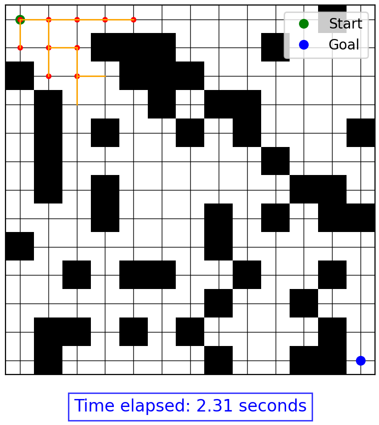

# Learning Path Planning

<p align="center">
  
</p>

This repository contains implementations of various pathfinding algorithms, so far including A*, Theta*, and Hybrid A*. These algorithms are used to find the shortest path between a start and a goal point, considering obstacles. The repository also includes an animation module to visualize the pathfinding process.

I created this repo to learn about path planning, maybe you can also learn a little something from it 😊 

If there are any algorithms you would like to see me implement, let me know! I have a roadmap of what algorithms I will do next, but I don't have the best overview of the algorithms out there, so I might miss some important ones!

## Algorithms Implemented

This is an ever-growing repository. Right now, I am exploring grid-based path planning algorithms and plan to expand to further 
techniques as I go.

### Grid-Based 
- **A***: A classic pathfinding algorithm that uses a heuristic to find the shortest path.
- **Theta***: An extension of A* that allows for any-angle pathfinding.
- **Hybrid A***: A pathfinding algorithm that considers vehicle kinematic constraints for smoother paths.

## Requirements

- Python 3.x
- NumPy
- Matplotlib
- PyYAML

## Installation

1. Clone the repository:
    ```sh
    git clone https://github.com/yourusername/learning-path-planning.git
    cd learning-path-planning
    ```

2. Install the required packages:
    ```sh
    pip install -r requirements.txt
    ```

## Configuration

The configuration for the pathfinding algorithms is stored in `config.yaml`. You can specify the algorithm to use, grid size, number of obstacles, and start and goal coordinates.

Example `config.yaml`:
```yaml
algorithm: "hybrid_a_star"  # Options: "a_star", "theta_star", "hybrid_a_star"
grid_size:
  x: 13
  y: 13
obstacles: 50  # Number of obstacles to add randomly
start: [0, 0]  # Start coordinates
goal: [12, 12]  # Goal coordinates
```

## Usage

1. Ensure the configuration file `config.yaml` is set up as desired.
2. Run the path planning script:
    ```sh
    python path_planning.py
    ```

The script will load the configuration, generate a grid with obstacles, and run the specified pathfinding algorithm. The pathfinding process will be animated, showing the exploration and the final path (if found).

## Files

- `graph_based/`: Implementation of the graph-based algorithms.
- `animation.py`: Module for animating the pathfinding process.
- `path_planning.py`: Main script to run the pathfinding algorithms and visualize the results.
- `config.yaml`: Configuration file for specifying algorithm parameters.

## License

This project is licensed under the MIT License. See the [LICENSE](LICENSE) file for details.